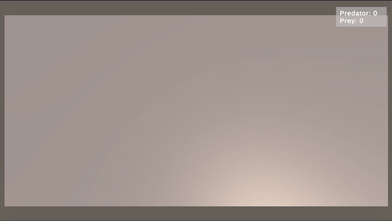

# Zoo Simulation

A lightweight 3D zoo simulation built in Unity, demonstrating a scalable and data-driven architecture for managing animal behaviors and interactions.

## Features

- **Animal Spawning:** Animals are spawned periodically within a confined zoo area.
- **Animal Creation:** New animal types (like Frogs and Snakes) are defined using `ScriptableObject`s, allowing designers to create new animals without writing new code.
- **Behavioral System:**
    - **Movement:** Animals can have distinct movement styles (e.g., linear `StraightMovement` or periodic `JumpMovement`).
    - **Food Chain:** Animals are categorized as Predators or Prey, with unique interaction logic.
- **Physics-Based Interactions:**
    - Predators eat Prey upon collision.
    - Predators fight each other, with one emerging as the victor.
    - Prey animals bounce off each other harmlessly.
- **Dynamic UI:**
    - An on-screen counter tracks the number of dead Predators and Prey, updating in real-time.
    - In-world text ("Tasty!") appears above a predator when it eats.